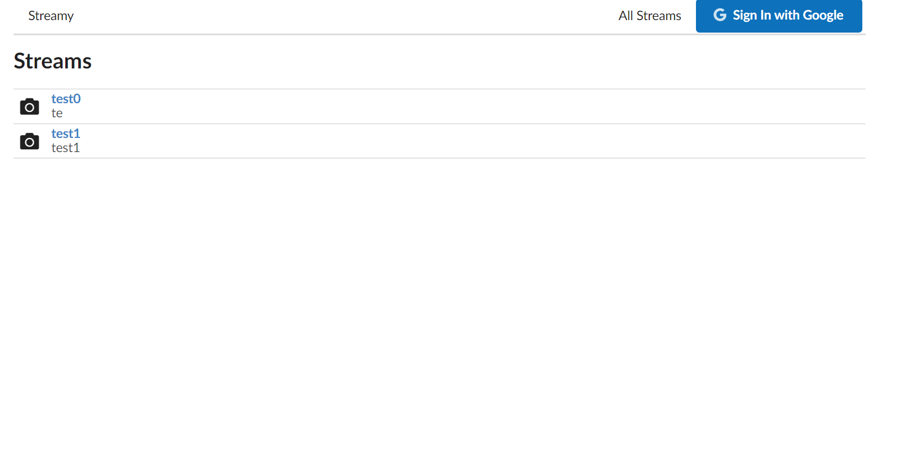
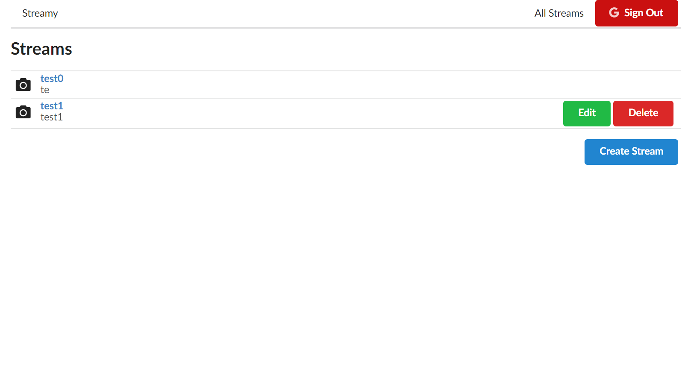

This is a **Single Page Application(SPA)** which allows users to share their screens to specific website.

To implement screen streaming functionality, we need to **host RTMP server locally**.

Different kind of users have different privileges.

**Users who don't sign in with Google account, they could only watch other's streaming video.**

**Users who sign in with Google account can create, read, update, delete streams.**

**Tech Stack:  
✨ React/Redux  
✨ React Router  
✨ Google Oauth  
✨ JSON Server  
✨ React thunk  
✨ React Form**  

Feature:  
🎈 implementing **authentication** with **Google Oauth**  
🎈 Create **modal** with **React Portal API**  
🎈 **Form validation** with **React Form**  
🎈 Layout with **Semantic UI**  
🎈 Backend **'JSON Server'** is **hosted on Heroku**, which means **data is consistent**  

